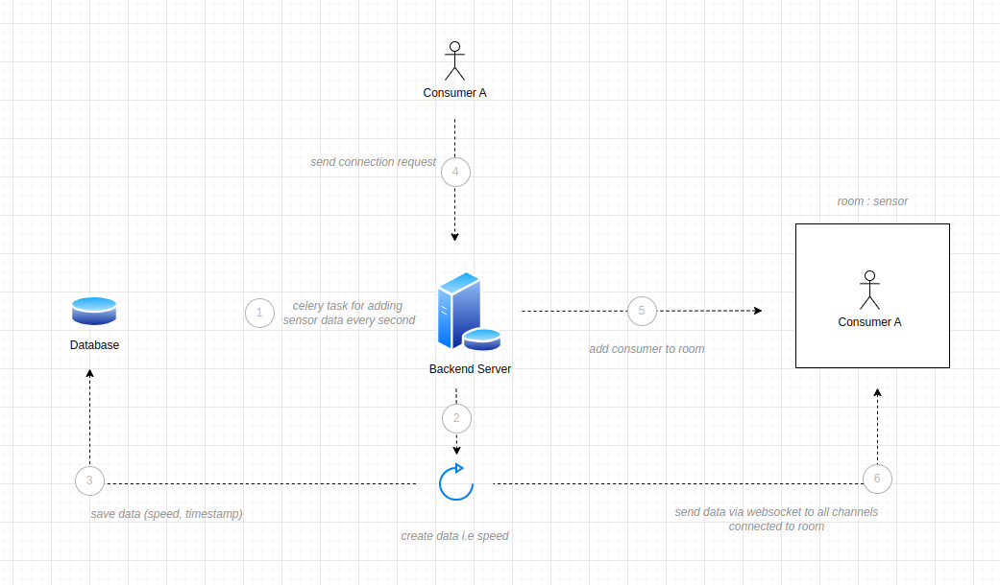
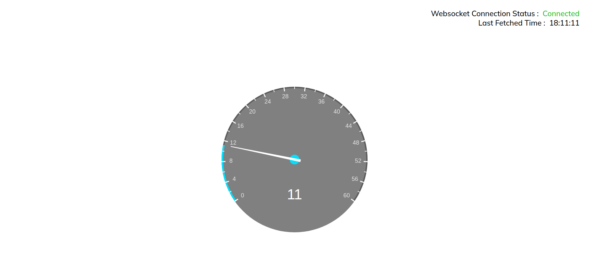

# Speedo-Meter Assignment | Unbox Robotics
`v1.0.0`

## Project Description

This backend service is used to :
- Create background tasks to store device/sensor speed in database
- Connect and disconnect users to websockets
- Send real-time data via websocket connection to clients

It is built using the following tech stack / libraries :

- Django (5.0.4)
- Celery (5.3.6)
- Channels (4.1.0)
- Daphne (4.1.0)
- Gunicorn (21.2.0)
- RabbitMQ

<br>

## Docker Container Description

This system consists of five distinct services / containers :

- wsgi : The main web container
- asgi_app : For websocket consumers
- rabbitmq : As a message broker
- celery worker : Workers to complete tasks
- celery beat : To schedule tasks

<br>

## System Prerequisites

1. Make sure you have docker and docker-compose installed on your local system.
2. Creating a `.env` environment file
    ```
    SECRET_KEY='<SECRET_KEY>'
    # if USE_POSTGRES='1', it will use postgresql
    USE_POSTGRES='0' 

    CELERY_BROKER_URL='amqp://rabbitmq'

    RABBITMQ_DEFAULT_USER='guest'
    RABBITMQ_DEFAULT_PASS='guest'
    ```
3. You can use the Sqlite3 database or connect to PostgreSQL database using credentials.
4. If connecting to PostgreSQL database, add the following `env` variables
    ```
    ENGINE='<value>',
    NAME='<value>',
    USER='<value>',
    PASSWORD'='<value>',
    HOST='<value>',
    PORT='<value>',
    ```

<br>

## Spinning up the server using Docker

1. Create migration files locally
    ```
    docker-compose run wsgi python3 manage.py makemigrations
    ```
2. The following command will spin up all the docker container services
    ```
    docker-compose up --build
    ```
3. The app will automatically migrate changes when you start the server (`setup.py` file)
3. Websocket consumer can connect to [`ws://localhost:8001/ws/speed-data/`](ws://localhost:8001/ws/speed-data/)

<br>

## Directory Structure

```
root
|
|----- core
|       |----- models.py
|       |----- admin.py
|       |----- others...
|
|----- speedometer
|        |----- wsgi.py
|        |----- asgi.py
|        |----- celery.py
|        |----- settings.py
|        |----- urls.py
|
|----- scripts
|        |----- setup.py
|
|----- utils
|        |----- celery
|                  |----- tasks.py
|
|----- websockets
|        |----- consumer.py
|        |----- routing.py
|        |----- utility.py
|
|----- DockerFile
|----- docker-compose.yaml
|
|----- requirements.txt
|
|----- README.md
|----- .env
|----- .gitignore
```


<br>

## Important URL's

Websocket URL : [ws://localhost:8001/ws/speed-data/](ws://localhost:8001/ws/speed-data/) <br>

Developed by : Hardik Ambati [LinkedIn](https://www.linkedin.com/in/hardik-ambati)

<br>

## Architecture

<div align="center">

</div>

<br>

## Sample App Image

<div align="center">

</div>